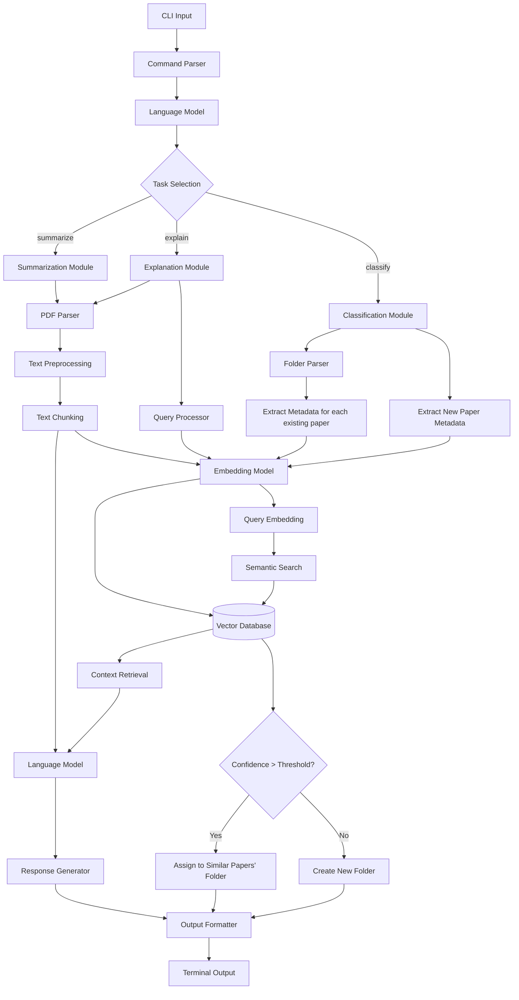

# System Architecture Documentation

## Overview
This system is a CLI-based document processing and analysis tool that handles three main tasks: summarization, explanation, and classification of research papers. The architecture uses natural language processing, semantic search, and machine learning models to provide intelligent document analysis.

## System Flow

### Input Processing
The system begins with **CLI Input** that flows through a **Command Parser** to interpret user commands. A **Language Model** then processes the parsed input to determine the appropriate task through **Task Selection**.

### Three Main Processing Paths

#### 1. Summarization Path
When users request document summarization:
- The system routes to the **Summarization Module**
- Documents are processed through the **PDF Parser** to extract text content
- Text undergoes **Text Preprocessing** to clean and normalize the content
- The processed text is divided into manageable pieces via **Text Chunking**
- Finally, the **Language Model** generates comprehensive summaries

#### 2. Explanation Path (Semantic Search Pipeline)
For explanation queries that require finding specific information within documents:
- Routes through the **Explanation Module** 
- Documents are parsed and preprocessed similar to summarization
- Text chunks are processed by the **Embedding Model** to create vector representations
- User queries are processed by the **Query Processor** for intent understanding
- The processed query is converted to vector form via **Query Embedding** using the same **Embedding Model**
- **Semantic Search** compares the query embedding against the **Vector Database**
- **Context Retrieval** extracts the most relevant document sections
- The **Language Model** generates explanations based on the retrieved context

#### 3. Classification Path
For organizing and categorizing research papers:
- Activates the **Classification Module**
- **Folder Parser** analyzes existing paper organization
- **Extract Metadata** for existing papers and new papers to be classified
- Both existing and new paper metadata are processed through the **Embedding Model**
- The system performs similarity matching against the **Vector Database**
- A **Confidence Threshold** determines the classification decision:
 - **High Confidence**: Papers are assigned to folders with similar existing papers
 - **Low Confidence**: New folders are created for unique papers

### Common Components

#### Embedding and Vector Storage
- The **Embedding Model** serves multiple purposes:
 - Converting document chunks to vector representations
 - Processing user queries for semantic search
 - Creating metadata embeddings for classification
- The **Vector Database** stores all embeddings for efficient similarity search

#### Output Generation
All paths converge through:
- **Language Model** for final response generation
- **Response Generator** for formatting model outputs
- **Output Formatter** for consistent presentation
- **Terminal Output** for user display
